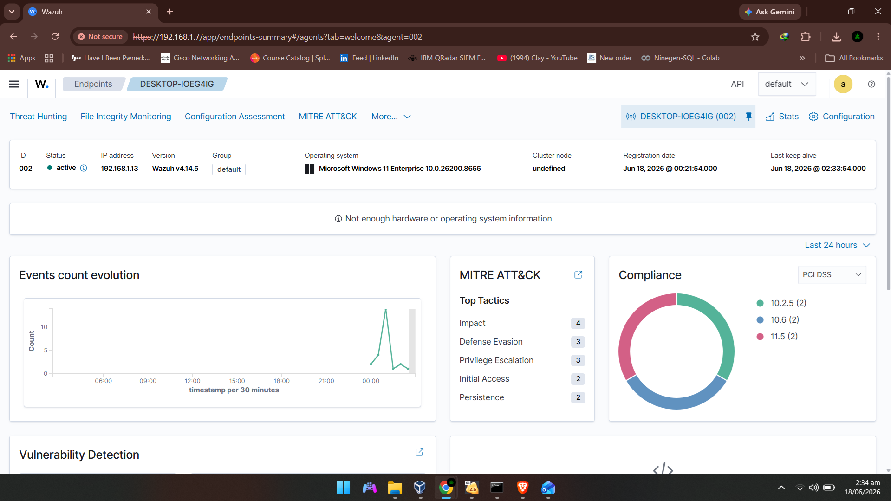
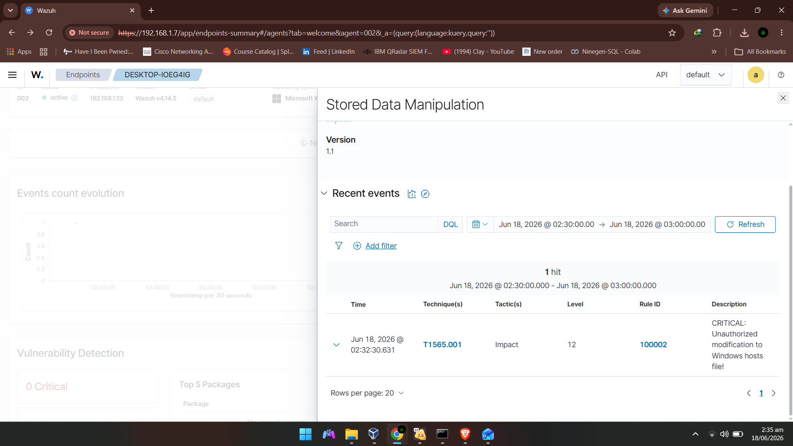
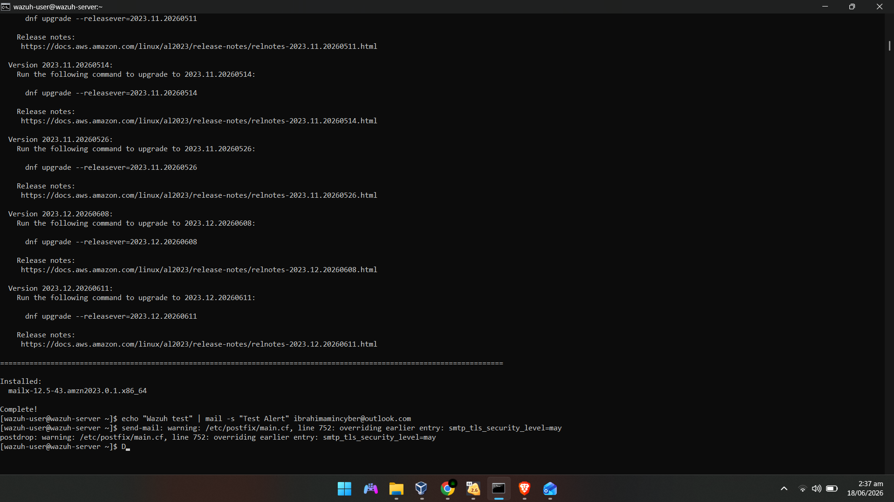
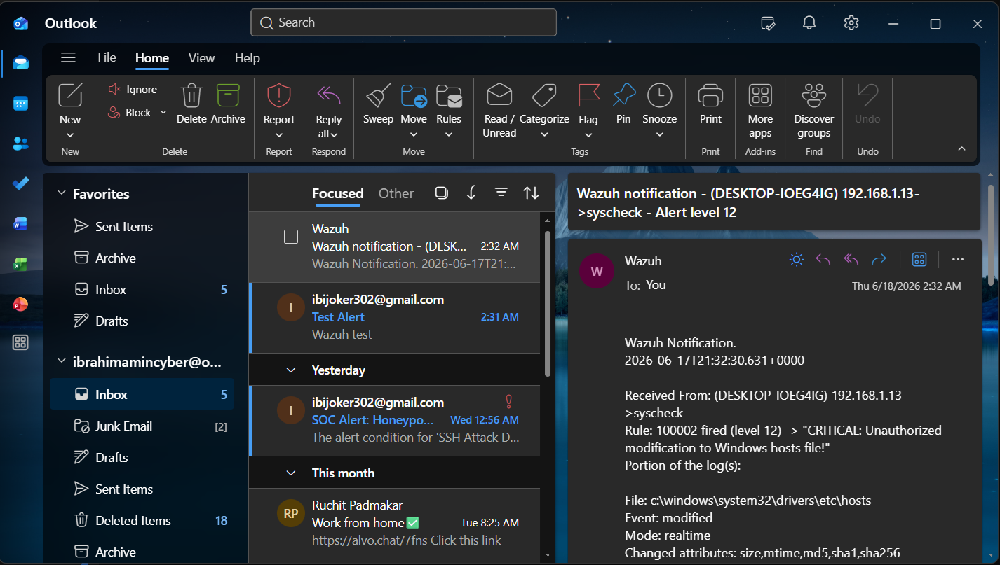

# Wazuh Detection Engineering: FIM Escalation Lab

## Project Overview
This project demonstrates the design and implementation of an end-to-end security monitoring and automated incident response pipeline. By deploying File Integrity Monitoring (FIM), I established a controlled environment to detect, visualize, and automatically respond to unauthorized modifications of critical Windows system files in real-time.

## Architecture
**Windows Host (Wazuh Agent) -> Wazuh Manager (Detection Engine) -> SMTP Alerting**
* **Wazuh Agent:** Monitors critical system paths and reports integrity changes.
* **Wazuh Manager:** Processes events, applies custom rule overrides, and manages alert severity.
* **Automated Response:** Configured SMTP integration for real-time security alerts.

## Custom Rule Implementation
```xml
<group name="fim,windows">
  <rule id="100002" level="12" overwrite="yes">
    <if_sid>550</if_sid>
    <match>c:\\windows\\system32\\drivers\\etc\\hosts</match>
    <options>no_full_log</options>
    <description>CRITICAL: Unauthorized modification to Windows hosts file!</description>
    <mitre>
      <id>T1565.001</id>
    </mitre>
  </rule>
</group>
```

## Lab Visualization & Evidence

### 1. Wazuh Agent Dashboard — Endpoint Overview (DESKTOP-IOEG4IG)
*Active agent registered with MITRE ATT&CK and Compliance mapping visible*


### 2. Critical Alert Triggered — Rule 100002 Fired (Level 12)
*Stored Data Manipulation panel showing 1 hit for T1565.001 (Impact) at 02:32:30*


### 3. SMTP Email Setup & Test — Postfix Configuration on Wazuh Server
*Terminal output confirming mailx installation and successful test email sent via Postfix*


### 4. Alert Captured in Inbox — Outlook Notification
*Wazuh email notification received confirming Rule 100002 fired for unauthorized hosts file modification*


## Testing & Validation
To validate the detection pipeline, I simulated an unauthorized modification to the Windows hosts file using the following command:

```bash
echo "127.0.0.1 malicious-site.com" >> C:\Windows\System32\drivers\etc\hosts
```
